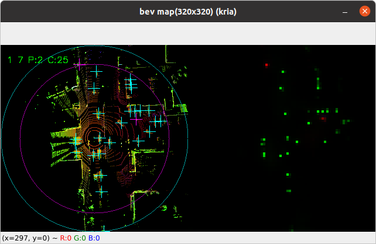

# 推論実行アプリケーション

## 実行環境

同一のソースで以下の２つの環境で動作を確認した。  

1. KV260 [Kria-PYNQ (Ubuntu20.04)](https://github.com/Xilinx/Kria-PYNQ)  
   FPGA に delegate 機構を介してアクセラレーション実行する。  

2. LinuxPC (Ubuntu20.06)  
   C++ reference model に delegate 実行する。  

## files

- **tfacc_load.py**  
  FPGA に fpga-data/design_1.bit ファイルから回路のコンフィグレーションを行う。  
  また、rv32emc コアのメモリーに、アクセラレータ制御プログラム(fpga-data/rvmon.mot) をロードする。  
- **infer.py**  
  tflite_runtime python ライブラリを用いて推論実行を行う。   
- **tensorflow_src/tflite_delegate/**  
  TFlite の delegate API で FPGA と接続するためのインターフェース関数のソースである。  
同時にハード実装のための C++ リファレンス実装でもある。  

  tflite_runtime と delegate interface の build は、[../tensorflow_src/README.md](../tensorflow_src/README.md) を参照。  


## 推論実行手順

#### 準備 : Kria-PYNQ (Ubuntu 20.04) 及び LinuxPC (Ubuntu 20.04)  
   - python3 の version は 3.8.10 
   - python3-opencv Pillow のインストールが必要  
   - [../tensorflow_src/README.md](../tensorflow_src/README.md) に従って tflite-runtime の build/install  
    及び dummy_external_delegate.so を build しておく。  

#### KV260 での推論実行

- login  
  KV260 / PYNQ Linux, based on Ubuntu 20.04  
  user : xilinx  
  pass : kria-260  
  ethernet address : kria.local  

  推論アプリ実行ディレクトリ :  
   /home/xilinx/app/  

- FPGA 初期化 (起動時に自動的に行われる)  
  初期化し直す場合は以下のコマンドを実行する  
  `$ sudo /etc/rc.local`  
  FPGA に ~shin/fpga-data/design_1.bit をロードし、fpga 内 risc-v cpu にプログラムロードする  
  ロードが終了し、risc-v が起動すると、KV260 の fan control が働くため fan が静音化する  
  ```
  ** Load "design_1.bit" to Overlay
  PL clock frequency
    rv32core : 100.0 MHz
    tfacc    : 187.5 MHz
  base:a0000000 range:10000
  *** Load "rvmon.mot" to processor memory
  ```

## 推論実行  

### ○ 結果を画像で表示  

  ```bash
   $ cd ~xilinx/app/
   $ sudo ./infer.py --view {options}
  ```
  - `../data/meta/meta_data.json` にしたがって `../data/train/3d_labels/samples/LIDAR_TOP/*.bin` を読んで推論実行し、結果を画像で表示  
   BEV画像とheat map を並べ、検出結果を ＋ カーソルで BEV画像上に表示  

  - 'ESC' キーで終了  
  - 'p' キーで 連続再生 / pause 切り替え  
  - pause 中は他の任意のキーで次のframe  

    終了時、"result/result-int8.json" に結果を出力

    
  　　　　　　　BEV 画像と heatmap 画像を表示する  
  　　　　　　　カーソル <span style="color:magenta;">＋</span>: Pedestorian <span style="color:cyan;">＋</span>: Car  
  　　　　　　　BEV 画像の円は、半径 <span style="color:magenta;">40m</span>、<span style="color:cyan;">50m</span>  

  options : --size {S,M,L}  BEV 画像サイズを選択できる  
    　　　　　　　　　BEV size S:320/M:448/L:608 (default: S)  
    　　　　--rot45 　BEV 画像を 45度回転し、画像の幅、高さを 84m 相当に設定  
    　　　　--fg　　　risc-v の preproc を並列実行せず、順次処理にする  


### ○ 推論時間計測  
  ```bash
  $ sudo ./infer.py {options}
  ```
  - `../data/meta/meta_data.json` にしたがって `../data/train/3d_labels/samples/LIDAR_TOP/*.bin` を読んで推論実行し、処理時間計測結果を表示  
  ```
  INFO: MyDelegate delegate: 35 nodes delegated out of 81 nodes with 12 partitions.
    :
  Loaded the model.   
  1
  pp:m_reg = 0xffff7fa7d000
  pp:prept = 0xffff7f37d000 : 40000000
  pre:   5.3 pred: 408.0 post:   8.5 ms
  pre:   5.8 pred: 408.0 post:   0.5 ms
      :
  pre:   5.8 pred: 407.7 post:  12.2 ms
  pre:   6.2 pred: 408.1 post:   5.8 ms
  pre:   4.9 pred: 408.4 post:   0.5 ms
  time average  pre:   5.6 pred: 408.2 post:   5.5 ms
  PL_if_free():cma_munmap
  PL_if_free():cma_free
  ```
  処理時間計測の起点: 　lider data 読み込みが完了した時点  
  pre: 　 前処理の準備 (BEV 画像 → set_tensor()) が完了するまでの時間   
  pred:　interpreter を invoke() して結果 (heatmap) を得るまでの時間  
  post:　heatmap から物体位置 json data を求めるまでの時間

  'ESC' キーで終了  
  終了時、"result/result-int8.json" に結果を出力


## 推論実行環境のファイル構成
```
├── app/
│   ├── infer.py              推論実行アプリ
│   ├── predictor.py
│   ├── csrc/                 C++ で記述した pre/post 処理
│   │   ├── postproc.cc
│   │   ├── preproc.cc           risc-v との pre 処理データ授受インターフェース
│   │   └── xlnk_wrap.cc         xrt xlnk wrapper
│   ├── model/                TFlite graph
│   │   ├── dummy_external_delegate.so    tflite delegate interface lib
│   │   ├── model-int8-320-R.tflite
│   │   ├── model-int8-320.tflite
│   │   ├── model-int8-448-R.tflite
│   │   ├── model-int8-448.tflite
│   │   ├── model-int8-608-R.tflite
│   │   ├── model-int8-608.tflite
│   └── result/
├── data/
│   ├── meta
│   │   ├── ans.json
│   │   └── meta_data.json        参照先リスト → lider data の指定
│   └── train
│        └── 3d_labels
│             └── samples
│                  └── LIDAR_TOP   
│                       ├── *.bin   
├── TF/
      ├── tensorflow_src/  
           └── tflite_delegate/      tflite delegate interface source
                └── bazel-bin            binary
                     └── tflite_delegate
                          ├── dummy_external_delegate.so
```


